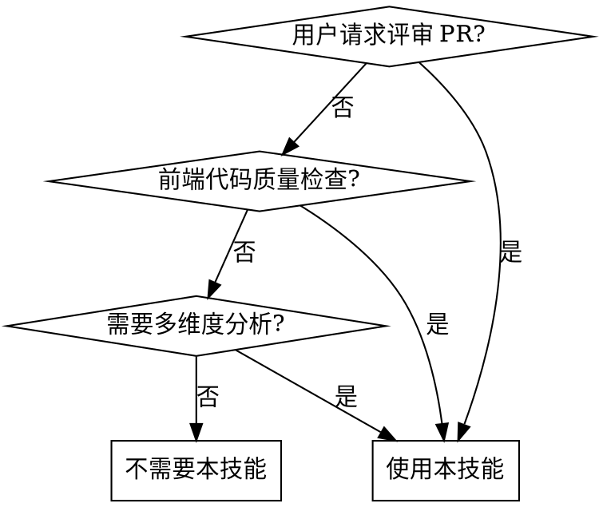

# 前端专家评审 (Expert Frontend Review)

## 概述

本技能通过模拟多个专业审查角色，对前端 Pull Request 进行全方位审计，不仅检查语法错误，更关注架构合规性、静默失败预防、测试质量及项目特定规范。

## 铁律 (Iron Rules)

**必须依次执行所有 8 个角色，禁止跳过任何一个。每个角色的检查必须显式验证，没有完成全部检查不得提交评审总结。**

**违反字面规则就是违反精神规则。** 这条原则禁止"我虽然跳过了某个角色，但是达到了精神要求"这类合理化。

**核心原则**：评审过程中严禁修改本地文件，所有修改建议必须通过 GitHub API 或脚本提交到 PR；所有评论必须使用中文。

## 何时使用



**使用本技能，当**：
- 用户请求对前端 PR 进行代码评审
- 需要对前端代码进行质量检查
- 需要多维度、多角色的全面审计
- 需要通过 GitHub API 提交行级修改建议
- 需要生成结构化的评审总结

**不使用本技能，当**：
- 审查非前端代码（如后端、DevOps 配置）
- 只需要简单的语法检查
- 评审目标是代码合并而非质量审计

## 快速参考

| 任务 | 命令/方法 | 说明 |
|------|-------------|------|
| 获取 PR 信息 | `gh pr view {pr_url} --json number,headRefOid,repository,baseRefName,headRefName` | 获取 PR 编号、最新 commit SHA 等关键信息 |
| 查看代码差异 | `gh pr diff {pr_url}` | 获取 PR 的代码变更 |
| 提交单行 Suggestion | `gh api repos/{owner}/{repo}/pulls/{pr_number}/comments -f body='...' -f commit_id='...' -F line={n} -f side='RIGHT' -f subject_type='line'` | 针对单行代码提交修改建议 |
| 提交多行 Suggestion | 同上，添加 `-F start_line={n} -f start_side='RIGHT'` | 针对多行代码块提交修改建议 |
| 提交评审总结 | `python skills/review-frontend/scripts/post_review_summary.py {pr_url} REVIEW_SUMMARY.md` | 使用脚本提交结构化评审总结 |
| 查看 PR 链接 | `gh pr view {pr_url} --json url -q .url` | 输出 PR URL 供用户查阅 |

## 评审角色

本技能使用 8 个专业审查角色进行全方位审计。评审时必须依次读取并应用以下角色的视角。

**注意**：每个角色的详细定义和检查项位于 `$WORK_HOME/CodeAgent/prompt/front_end_review/` 或 `~/CodeAgent/prompt/front_end_review/` 目录下的独立文件中。

**角色清单**：
1. **general-coding-standards-checker**
   文件：`general-coding-standards-checker.md`

2. **code-reviewer**
   文件：`code-reviewer.md`

3. **project-structure-check**
   文件：`project-structure-check.md`

4. **javascript-reviewer**
   文件：`javascript-reviewer.md`

5. **frontend-spec-check**
   文件：`frontend-spec-check.md`

6. **silent-failure-hunter**
   文件：`silent-failure-hunter.md`

7. **pr-test-analyzer**
   文件：`pr-test-analyzer.md`

8. **comment-analyzer**
   文件：`comment-analyzer.md`

## 任务执行流程

### 第一步：初始化与上下文获取

使用以下命令获取 PR 的基本信息及当前最新的 Commit SHA：

```bash
# 获取 PR 详情 (必须使用完整 URL)
gh pr view {pr_url} --json number,headRefOid,repository,baseRefName,headRefName

# 验证仓库一致性
# 检查 repository.nameWithOwner 是否与 {pr_url} 中的仓库匹配

# 获取代码差异
gh pr diff {pr_url}
```

**注意**：`headRefOid` 将用于后续提交评论，确保指向的是最新的代码。

### 第二步：多维度深度评审（强制执行）

**强制步骤 0**：读取角色定义
使用 `read` 工具读取 `$WORK_HOME/CodeAgent/prompt/front_end_review/{角色文件名}.md` 或 `~/CodeAgent/prompt/front_end_review/{角色文件名}.md`。
**禁止跳过此步骤**：必须完整阅读每个角色文件中的检查项，禁止凭印象或简要说明进行检查。

**必须按照以下顺序依次执行所有 8 个角色**：

1. **general-coding-standards-checker**
   - 读取 `general-coding-standards-checker.md`
   - 按照文件中的检查项逐一验证

2. **code-reviewer**
   - 读取 `code-reviewer.md`
   - 按照文件中的检查项逐一验证

3. **project-structure-check**
   - 读取 `project-structure-check.md`
   - 按照文件中的检查项逐一验证

4. **javascript-reviewer**
   - 读取 `javascript-reviewer.md`
   - 按照文件中的检查项逐一验证

5. **frontend-spec-check**
   - 读取 `frontend-spec-check.md`
   - 按照文件中的检查项逐一验证

6. **silent-failure-hunter**
   - 读取 `silent-failure-hunter.md`
   - 按照文件中的检查项逐一验证

7. **pr-test-analyzer**
   - 读取 `pr-test-analyzer.md`
   - 按照文件中的检查项逐一验证

8. **comment-analyzer**
   - 读取 `comment-analyzer.md`
   - 按照文件中的检查项逐一验证

**强制要求**：
- 每个角色都必须读取对应的角色定义文件，不得省略
- 按照文件中的检查项逐一验证，禁止只看简要说明
- 检查结果必须记录到评审总结中
- 交叉验证：确保一个角色的修复不会违反另一个角色的规范（例如：修复静默失败时不要引入不规范的变量命名）

### 第三步：提交行级修改建议 (Suggestions)

对于识别出的每个高置信度问题，构造 `suggestion` 评论。

**单行修改**：
```bash
gh api repos/{owner}/{repo}/pulls/{pr_number}/comments \
  -f body='[角色名] 发现违反规范：{具体原因}' \
  -f commit_id='{headRefOid}' \
  -f path='{file_path}' \
  -F line={line_number} \
  -f side='RIGHT' \
  -f subject_type='line'
```

**多行修改**：添加 `start_line` 和 `start_side` 参数。

### 第四步：提交评审总结

使用内置脚本提交整体 Review 总结。

**操作步骤**：
1. 生成评审总结文件 `REVIEW_SUMMARY.md`，包含完整的评审总结内容（参考 [assets/REVIEW_SUMMARY_EXAMPLE.md](assets/REVIEW_SUMMARY_EXAMPLE.md)）
2. 运行脚本（必须使用完整 PR URL）：
   ```bash
   python skills/review-frontend/scripts/post_review_summary.py {pr_url} REVIEW_SUMMARY.md
   ```
3. 删除临时文件

**脚本特性**：
- 自动清理本地路径等敏感信息
- 保持 Markdown 格式，直接展示完整内容
- 自动验证评审总结的基本格式
- 内容超过 60000 字符时自动截断

### 第五步：反馈 PR 链接

输出 PR URL 以便用户查阅：
```bash
gh pr view {pr_url} --json url -q .url
```

## 脚本使用详解

### 基本用法

```bash
# 使用 PR 编号
python skills/review-frontend/scripts/post_review_summary.py 123 REVIEW_SUMMARY.md

# 使用 PR URL
python skills/review-frontend/scripts/post_review_summary.py https://github.com/owner/repo/pull/123 REVIEW_SUMMARY.md

# 指定仓库（非仓库目录下使用）
python skills/review-frontend/scripts/post_review_summary.py 123 REVIEW_SUMMARY.md --repo owner/repo

# 跳过格式验证
python skills/review-frontend/scripts/post_review_summary.py 123 REVIEW_SUMMARY.md --skip-validation
```

### 参数说明

| 参数 | 必需 | 说明 |
|------|--------|------|
| `pr_input` | 是 | PR URL 或编号 |
| `summary_file` | 是 | 包含评审总结的 Markdown 文件路径 |
| `--repo` | 否 | 仓库名称，格式为 `owner/repo` |
| `--skip-validation` | 否 | 跳过评审总结格式验证 |

## 常见错误

| 错误 | 原因 | 修复方法 |
|------|------|----------|
| commit 不存在 | `headRefOid` 已过期或 PR 有更新 | 重新获取 `headRefOid` |
| 行号偏移 | `gh pr diff` 输出与实际代码不匹配 | 仔细确认行号，确保 Suggestion 上下文完全匹配 |
| 脚本提交失败 | `gh` 未安装或配置，或无 PR 读写权限 | 检查 `gh` 安装、配置和权限 |
| Suggestion 提交失败 | API 限制或网络问题 | 将建议输出到对话，仍尝试通过脚本提交评审总结 |
| 评审总结格式错误 | 缺少必要章节 | 检查是否包含"前端专家评审报告"、"参与评审的角色"、"评审摘要"、"整体结论" |

## 常见合理化与反驳

 | 常见合理化 | 现实 | 立即行动 |
 |-------------|------|----------|
 | "我觉得不需要读角色文件，SKILL.md 已经有说明了" | 必须读取完整的角色定义文件，详细检查项不在 SKILL.md 中 | 读取对应的角色定义文件 |
 | "这个角色不需要，代码很简单" | 8 个角色必须全部执行，简单代码也需要全面审查 | 执行该角色，检查清单 |
 | "我已经手动检查过了" | 手动检查不是替代方案，必须按照规范显式验证 | 重新执行角色检查 |
 | "我觉得不需要那么详细" | 详细检查是评审的核心价值，"觉得"不等于验证 | 完整执行所有检查 |
 | "这个是特殊情况，不适用" | 特殊情况也需要按照规范检查，避免疏漏 | 执行检查并记录特殊情况 |
 | "太繁琐了，我快速过一遍" | 快速扫描 = 没有检查，等于违反铁律 | 立即停止，重新开始 |
 | "我覆盖了几个角色" | 覆盖不是替代，必须逐个角色显式检查 | 重新执行所有角色 |
 | "我记得角色文件的内容，不需要再读" | 记忆不等于验证，必须显式读取角色文件 | 读取对应的角色定义文件 |

## 红色警报 - 立即停止并重做

如果出现以下情况，立即停止当前评审，删除所有工作成果，重新开始：

- 没有读取角色定义文件就开始检查
- 只看 SKILL.md 中的简要说明而不读取详细的角色定义
- 使用"我记得"、"我印象中"代替读取角色文件
- 以"角色文件太长"为理由跳过读取
- 跳过任何一个角色（8 个角色必须全部执行）
- 没有按照定义的顺序执行角色
- 使用"我觉得"、"快速过一遍"、"覆盖了"等模糊表述代替显式检查
- 以"代码很简单"、"特殊情况"、"太繁琐"为理由省略检查
- 没有完成全部 8 个角色就提交评审总结

**所有以上情况都意味着：停止并重做。不允许有任何例外。**

## 异常处理

- **Commit 冲突**：如果 API 报错显示 commit 不存在，请重新获取 `headRefOid`
- **行号偏移**：在 `gh pr diff` 输出中仔细确认行号
- **脚本提交失败**：检查 `gh` 命令是否已安装并配置、是否有 PR 的读写权限、仓库路径是否正确
- **Suggestion 失败**：如果无法提交行级 Suggestion，请将所有建议以 Markdown 列表形式输出在对话中，但仍尝试通过脚本提交评审总结
